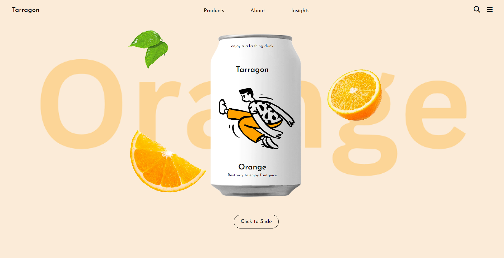
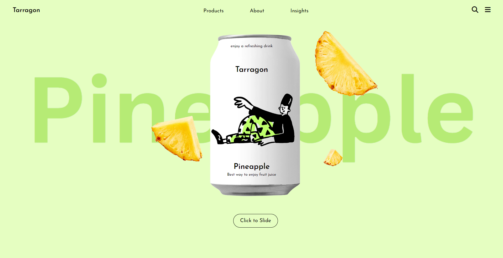

# Tarragon Fruit Juice Landing Page

Welcome to the **Tarragon Fruit Juice Landing Page!** This project is a simple and attractive landing page built using **React.js and Tailwind CSS.** It is inspired by a design on Figma provided by the YouTube channel "Shift studio." The purpose of this project is to demonstrate my coding skills and create an appealing user interface for a fictional fruit juice brand called Tarragon.

### Figma design

### Screenshots

### Features

- **Interactive Sliding**: Users can click the "Click to Slide" button to toggle between two different fruit juice pages - Orange and Pineapple.

- **Navigation Bar**: A stylish navigation bar at the top provides easy access to various sections of the landing page.

- **Engaging Visuals**: Engage users with eye-catching visuals, including images of fruit juice cans and fruit heroes.

### Technologies Used

- React.js: A popular JavaScript library for building user interfaces.

- Tailwind CSS: A utility-first CSS framework for rapidly building custom designs.

### Project Structure

- **HomePage**: The main component that manages the landing page, including the sliding functionality.

- **NavBar**: The navigation bar component at the top of the page.

- **OrangePage**: The Orange fruit juice page component.

- **PineapplePage**: The Pineapple fruit juice page component.

- **assets**: Folder containing images used in the project.

### Acknowledgments

- Special thanks to the YouTube channel **Shift studio** for providing the design inspiration for this project.

### Contact Information

If you have any questions or feedback about this project, feel free to reach out to me:

- Email: tribhuvan1256@gmail.com
- GitHub: [Tribhuvan-Kumar](https://github.com/Tribhuvan-Kumar)

Thank you for checking out the Tarragon Fruit Juice Landing Page! Enjoy exploring the colorful world of fruit juice.
